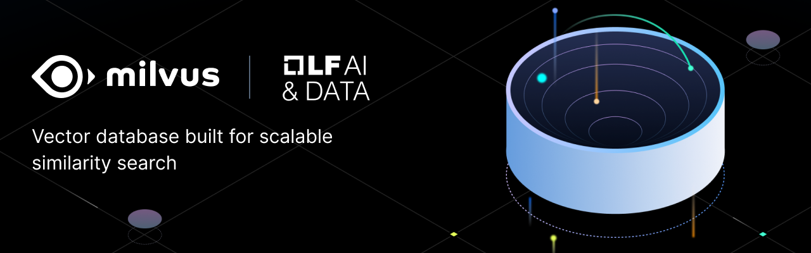

# Milvus CI/CD pipeline

Deploy Milvus server with CI/CD on Elestio

 
 

# Once deployed ...

Milvus credentials:

    URL: [CI_CD_DOMAIN]:19530
    login: root
    password: [ADMIN_PASSWORD]

# Using Milvus

## Installation

To use the Milvus SDK for Node.js, install it with:

    npm install @zilliz/milvus2-sdk-node

## Initialization

nitialize your Milvus instance in Node.js with the following code:

    const { MilvusClient } = require("@zilliz/milvus2-sdk-node");

    const address = "[CI_CD_DOMAIN]:19530";

    client = new MilvusClient({
        address,
        username: "root",
        password: "[ADMIN_PASSWORD]",
    });

## Creating a Database

You can create a database with the following code:

    const createDatabase = async () => {
        res = await client.createDatabase({
            db_name: "my_database",
        });

        console.log(res);
    };
    createDatabase()

## List databases

You can list all databases with the following code:

    const listDatabases = async () => {
        res = await client.listDatabases();

        console.log(res);
    };
    listDatabases()

## Documentation

For more information, visit https://milvus.io/docs
